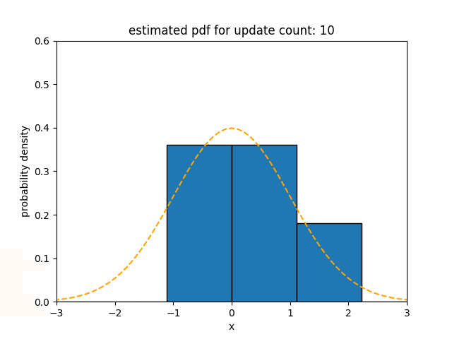
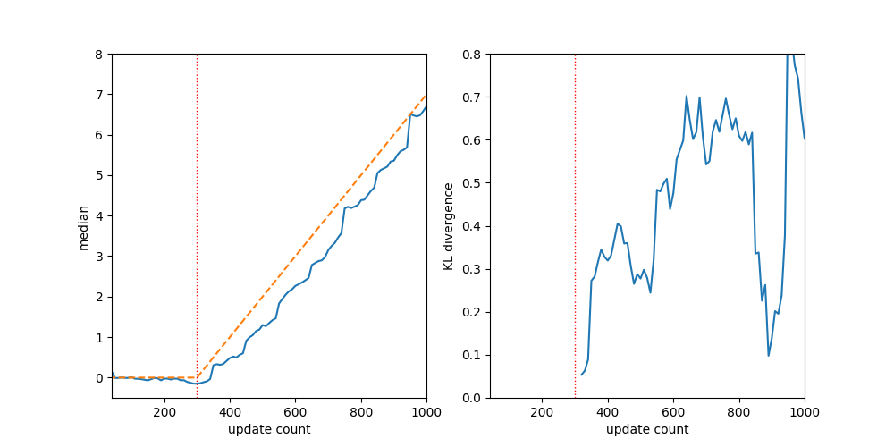

# Experiment

`Sketch` of *Flip* estimates density from data stream under various conditions. When the data follows stationary statistical properties such as normal, bimodal, log-normal, and pareto, it can be reasonably estimated. Even if the concept drift that is varying statistical properties of the underlying distribution of the data stream occurs in a various ways, `Sketch` can successfully estimate the probability density.

## Standard normal distribution

 

## Bimodal distribution consisting of two standard normal distributions

Here is a result for a bimodal probabability density function consisting of two standard normal distributions centered at -2 and 2.

## Log-normal distribution

 

## Pareto distribution

 

## Gradual concept drift

Here is a experimental result under the situation where the distribution that `Sketch` should estimate is gradually changing over time. The underlying distribution starts to change when the update count is 300 and moves by +0.01 per update count. Sketch is predicting this moving distribution well including some lag.

This figure shows the estimated median and KL-divergence by using `Sketch`.

## Sudden concept drift

Here is a experimental result under the situation where the distribution that `Sketch` should estimate is changing suddenly. When the update count is 300, the underlying standard normal distribution suddenly moves its center to the point at 5.

 

This figure shows the estimated median and KL-divergence by using `Sketch`.
