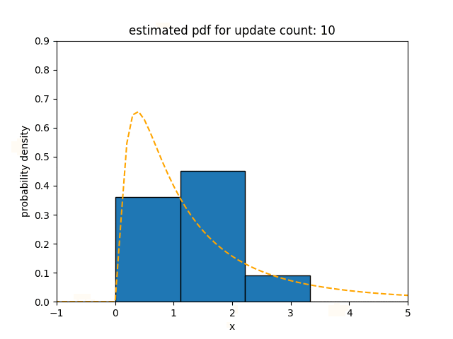
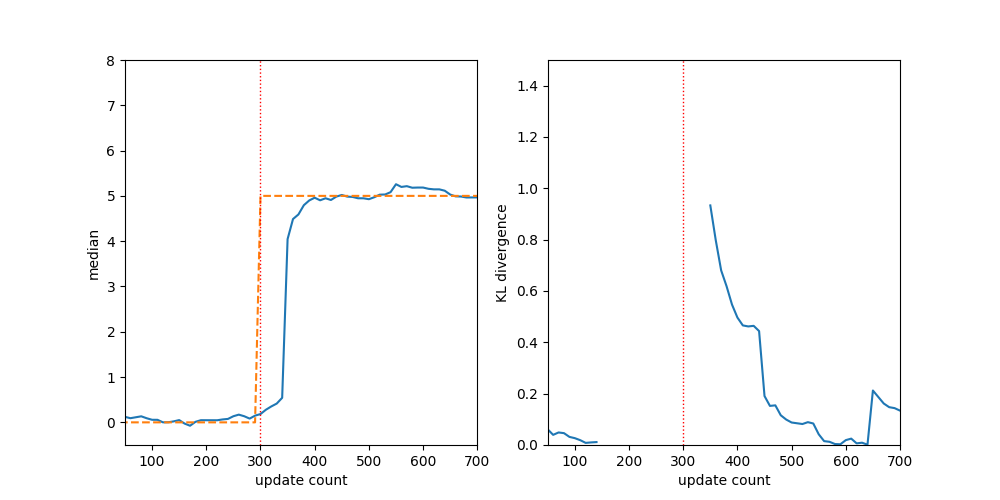

# Experiment

`Sketch` of *Flip* estimates density from data stream under various conditions. When the data follows stationary statistical properties such as normal, bimodal, log-normal, and pareto, it can be reasonably estimated. Even if the concept drift that is varying statistical properties of the data stream occurs suddenly or gradually, `Sketch` can successfully estimate the probability density. 

## Standard normal distribution

 

## Bimodal distribution consisting of two standard normal distributions

Here is a result for a bimodal probabability density function consisting of two standard normal distributions centered at -2 and 2.

## Log-normal distribution

 

## Pareto distribution

 

## Gradual concept drift

Here is a experiment result under the situation where the distribution that `Sketch` should estimate is gradually changing over time. The underlying distribution starts to change when the update count is 300 and moves by +0.01 per update count. Sketch is predicting this moving distribution well including some lag.

This figure shows the estimated median and KL-divergence by using `Sketch`.

## Sudden concept drift

Here is a experiment result under the situation where the distribution that `Sketch` should estimate is changing suddenly. When the update count is 300, the underlying standard normal distribution suddenly moves its center to the point at 5.

 

This figure shows the estimated median and KL-divergence by using `Sketch`.

## `flatMap`

If you choose a first order function `A ⇒ Kernel` from value `A` to kernel function `Kernel` centered on the given value `A` as a parameter of `flatMap`, this operation is a probability distribution smoothing method, often called kernel density estimation, or KDE for short. 

The following figure shows the result of implementing KDE as a simple example of `flatMap`. At first, log-normal distribution is estimated by `Sketch`. Then, KDE with normal distribution with deviation 1.5 as kernel function executes.

## `map`

The following figure is the result of an experiment that estimates the standard normal distribution using `Sketch` and then transform the domain to the log-normal distribution using the `map` operation. 

By definition, the [log-normal distribution](https://en.wikipedia.org/wiki/Log-normal_distribution#Characterization) is a distribution that takes the log of domain X for a normal distribution. Therefore, if `Sketch` which is learned by normal distribution executes `map` operation, that is `stdSketch.map(x => math.exp(x))`, the log-normal distribution should be obtained as a result.

